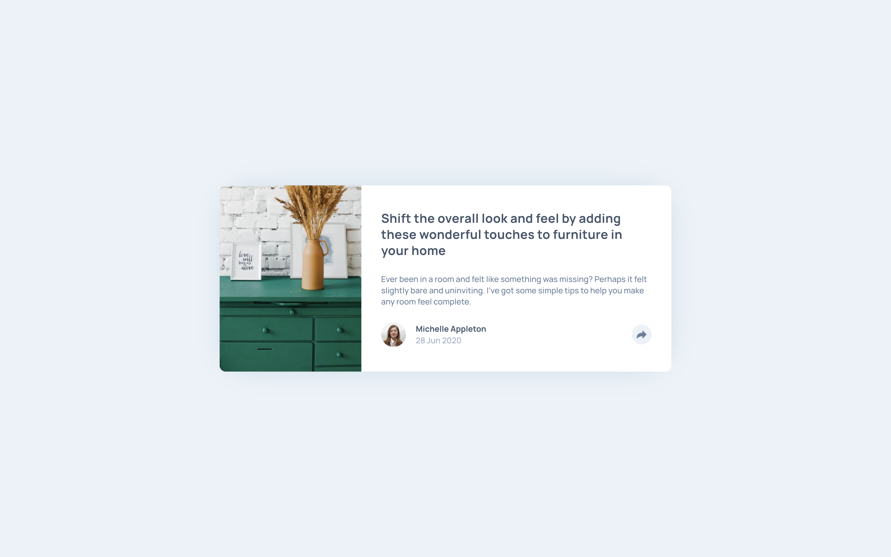

# Frontend Mentor - Article preview component solution

## Table of contents

- [Overview](#overview)
  - [The challenge](#the-challenge)
  - [Screenshot](#screenshot)
  - [Links](#links)
- [My process](#my-process)
  - [Built with](#built-with)
  - [What I learned](#what-i-learned)
  - [Continued development](#continued-development)
- [Author](#author)

## Overview

### The challenge

Users should be able to:

- View the optimal layout for the component depending on their device's screen size
- See the social media share links when they click the share icon

### Screenshot



### Links

- Solution URL: [https://github.com/anamaydev/FrontEndMentor/tree/main/article-preview-component](https://github.com/anamaydev/FrontEndMentor/tree/main/article-preview-component)
- Live Site URL: [https://anamaydev.github.io/FrontEndMentor/article-preview-component/index.html](https://anamaydev.github.io/FrontEndMentor/article-preview-component/index.html)

## My process

### Built with

- Semantic HTML5 markup
- CSS custom properties
- Flexbox
- CSS Grid
- Mobile-first workflow


### What I learned
While building this project, I learn the following concepts <br>
***css***
  - transition
    ```css
    .social-media-button{
      cursor: pointer;
      transition-property: transform;
      transition-duration: 0.25s;
      transition-timing-function: ease;
    }
  
    .social-media-button:hover{
      transform: scale(1.2);
    }
    ```
  - `::after` / `::before` pseudo element
    - using a pseudo-element, we can add decorations before or after the element
    ```css
      .article__share-tablet::after{
      content: "";
      position: absolute;
      height: 0;
      width: 0;
      border-top: 1rem solid var(--color-grey-900);
      border-left: 1rem solid transparent;
      border-right: 1rem solid transparent;
      left: 50%;
      bottom: -0.75rem;
      transform: translateX(-50%);
    }
    ```
***javascript***
  - read window width 
    ```js
      console.log(window.innerWidth)
    ```
  - resize window event
    ```js
      window.addEventListener("resize", ()=>{
        console.log("window resized");
      });
    ```
  - load window event
    ```js
      window.addEventListener("load", ()=>{
        console.log("page loaded");
      });
    ```
  - `check` event
    ```js
      shareButton.addEventListener("check", ()=>{
        shareButton.checked ? console.log("check") : console.log("uncheck");
      })
    ```
    
### Continued development
I would like to add animation to the share pop up when it appears and disappears.

## Author
- Frontend Mentor - [@anamaydev](https://www.frontendmentor.io/profile/anamaydev)
