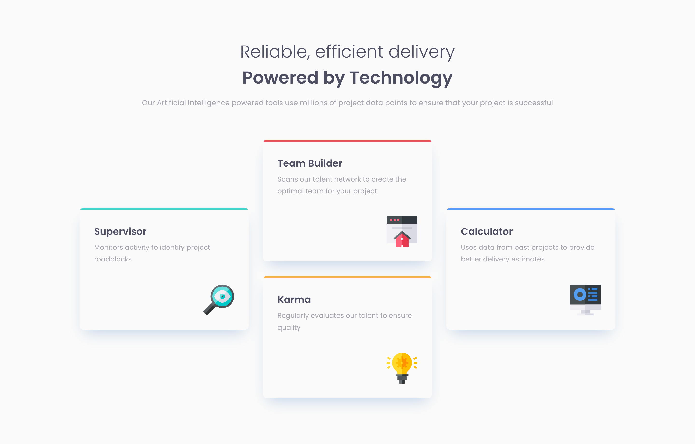

# Frontend Mentor - Four card feature section solution

## Table of contents

- [Overview](#overview)
  - [The challenge](#the-challenge)
  - [Screenshot](#screenshot)
  - [Links](#links)
- [My process](#my-process)
  - [Built with](#built-with)
  - [What I learned](#what-i-learned)
  - [Useful resources](#useful-resources)
- [Author](#author)

## Overview

### The challenge

Users should be able to:

- View the optimal layout for the site depending on their device's screen size

### Screenshot

**Desktop View**

### Links

- Solution URL: [https://github.com/anamaydev/FrontEndMentor/tree/main/fourCardFeatureSection](https://github.com/anamaydev/FrontEndMentor/tree/main/fourCardFeatureSection)

- Live Site URL: [https://anamaydev.github.io/FrontEndMentor/fourCardFeatureSection/index.html](https://anamaydev.github.io/FrontEndMentor/fourCardFeatureSection/index.html)

## My process

### Built with

- Semantic HTML5 markup
- CSS custom properties
- Flexbox
- CSS Grid

### What I learned

I was getting way too comfortable with Flexbox and was procrastinating on learning Grid, but this tutorial really helped me get out of my comfort zone.

### Useful resources

- [#37 CSS Grid Tutorial \[Complete Guide\] - CSS Full Tutorial](https://www.youtube.com/watch?v=RhUuMl3R1PE) - This helped me revise CSS Grid.
- [CSS Box-Shadow tutorial: the basics](https://www.youtube.com/watch?v=-JNRQ5HjNeI) - This helped me brush up box-shadow property.

## Author

- Frontend Mentor - [@anamaydev](https://www.frontendmentor.io/profile/anamaydev)