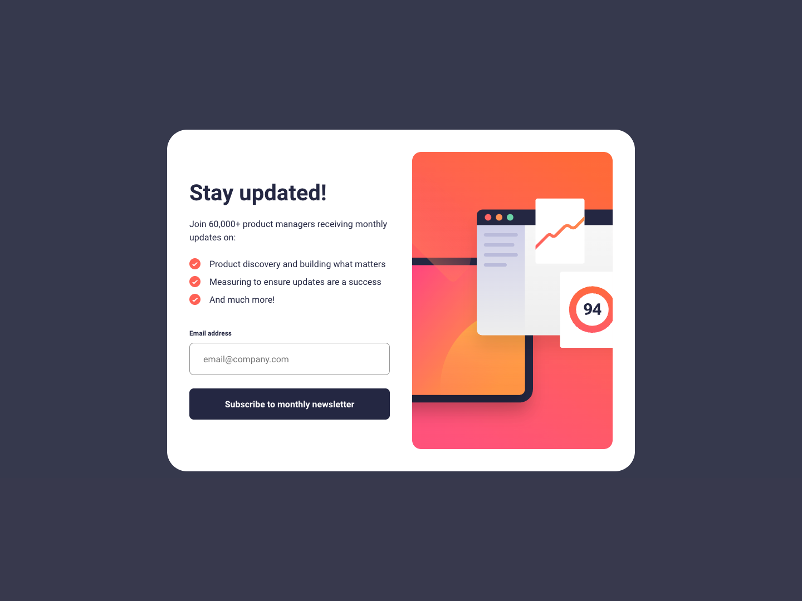

# Frontend Mentor - Newsletter sign-up form with success message solution

This is a solution to the [Newsletter sign-up form with success message challenge on Frontend Mentor](https://www.frontendmentor.io/challenges/newsletter-signup-form-with-success-message-3FC1AZbNrv). Frontend Mentor challenges help you improve your coding skills by building realistic projects. 

## Table of contents

- [Overview](#overview)
  - [The challenge](#the-challenge)
  - [Screenshot](#screenshot)
  - [Links](#links)
- [My process](#my-process)
  - [Built with](#built-with)
  - [What I learned](#what-i-learned)
  - [Useful resources](#useful-resources)
- [Author](#author)

## Overview

### The challenge

Users should be able to:

- Add their email and submit the form
- See a success message with their email after successfully submitting the form
- See form validation messages if:
  - The field is left empty
  - The email address is not formatted correctly
- View the optimal layout for the interface depending on their device's screen size
- See hover and focus states for all interactive elements on the page

### Screenshot



### Links

- Solution URL: [https://github.com/anamaydev/FrontEndMentor/tree/main/newsletter-sign-up](https://github.com/anamaydev/FrontEndMentor/tree/main/newsletter-sign-up)
- Live Site URL: [https://anamaydev.github.io/FrontEndMentor/newsletter-sign-up/index.html](https://anamaydev.github.io/FrontEndMentor/newsletter-sign-up/index.html)

## My process

### Built with

- Semantic HTML5 markup
- CSS custom properties
- Flexbox
- CSS Grid
- Mobile-first workflow

### What I learned
- `e.preventDefault()` prevents submitting form directly to the server giving time to validate the form client size first.
```js
fomr.addEventListener("submit", (e)=>{
  e.preventDefault();
})
```
- learned to put a gradient background
```css
.cta{
  background: linear-gradient(90deg, hsla(15, 100%, 61%, 1), hsla(346, 100%, 66%, 1));
}
```
### Useful resources

- [JavaScript Client-side Form Validation](https://www.youtube.com/watch?v=rsd4FNGTRBw) - This helped understand form validation process step by step.

## Author
- Frontend Mentor - [@anamaydev](https://www.frontendmentor.io/profile/anamaydev)