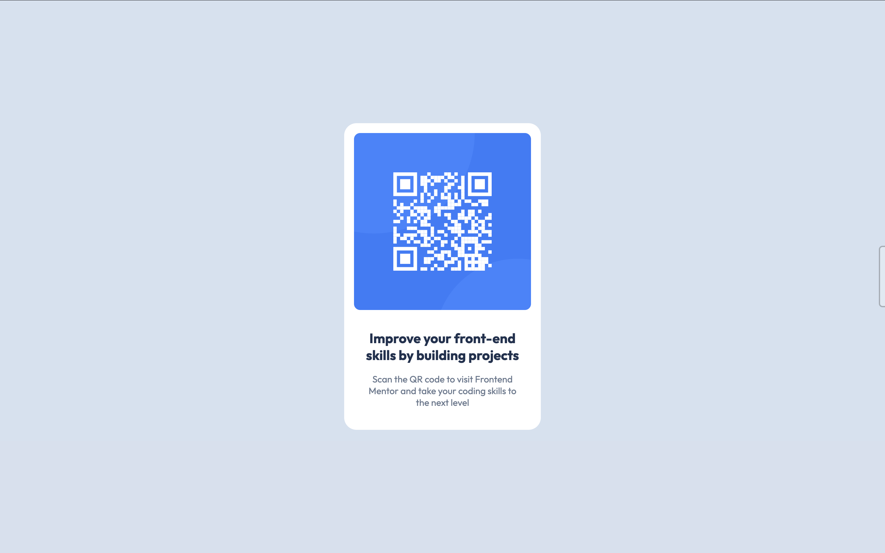

# Frontend Mentor - QR code component solution

## Table of contents

- [Overview](#overview)
  - [Screenshot](#screenshot)
  - [Links](#links)
- [My process](#my-process)
  - [Built with](#built-with)
  - [What I learned](#what-i-learned)
- [Author](#author)

## Overview

### Screenshot

### Links

- Solution URL: [https://github.com/anamaydev/FrontEndMentor/tree/main/QRCodeComponent](https://github.com/anamaydev/FrontEndMentor/tree/main/QRCodeComponent)
- Live Site URL: [https://anamaydev.github.io/FrontEndMentor/QRCodeComponent/index.html](https://anamaydev.github.io/FrontEndMentor/QRCodeComponent/index.html)

## My process

### Built with

- HTML5
- CSS
- Flexbox

### What I learned

During this HTML/CSS challenge, I learned some really cool things that will come in handy for future web design projects. For example, I now know how to center a div using flex box, which is a powerful tool for creating awesome layouts. I also picked up some tricks for positioning images in a way that makes them look super cool and eye-catching. Overall, I'm feeling pretty proud of myself for picking up these new skills, and I'm excited to see how I can use them to make some seriously awesome websites!

## Author

- Frontend Mentor - [@anamaydev](https://www.frontendmentor.io/profile/anamaydev)
