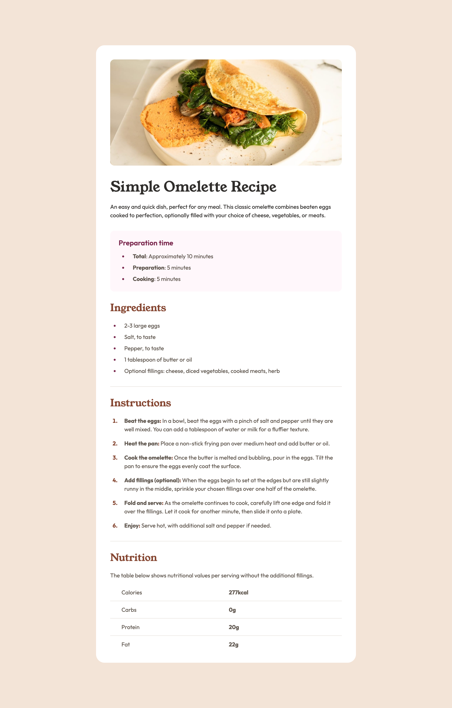

# Frontend Mentor - Recipe page solution

## Table of contents

- [Overview](#overview)
  - [Screenshot](#screenshot)
  - [Links](#links)
- [My process](#my-process)
  - [Built with](#built-with)
  - [What I learned](#what-i-learned)
  - [Useful resources](#useful-resources)
- [Author](#author)

## Overview

### Screenshot

### Links

- Solution URL: [https://github.com/anamaydev/FrontEndMentor/tree/main/recipePageMain](https://github.com/anamaydev/FrontEndMentor/tree/main/recipePageMain)
- Live Site URL: [https://anamaydev.github.io/FrontEndMentor/recipePageMain/index.html](https://anamaydev.github.io/FrontEndMentor/recipePageMain/index.html)

## My process

### Built with

- Semantic HTML5 markup
- CSS custom properties
- Flexbox
- CSS Grid
- Mobile-first workflow

### What I learned
I learned that `+` represents an adjacent sibling, it selects an element that is immediately next to another element. `ol > li + li`, it means "select every `<li>` that is directly after another `<li>` inside an `<ol>`." The two elements must be siblings (have the same parent), and the second one must immediately follow the first.

### Useful resources

- [Refresh Media Query](https://www.youtube.com/watch?v=yU7jJ3NbPdA) - This helped me refresh media query concepts
- [CSS sibling selector](https://stackoverflow.com/questions/19254411/how-do-i-set-vertical-space-between-list-items) - Learned great trick about sibling selector

## Author

- Frontend Mentor - [@anamaydev](https://www.frontendmentor.io/profile/anamaydev)
