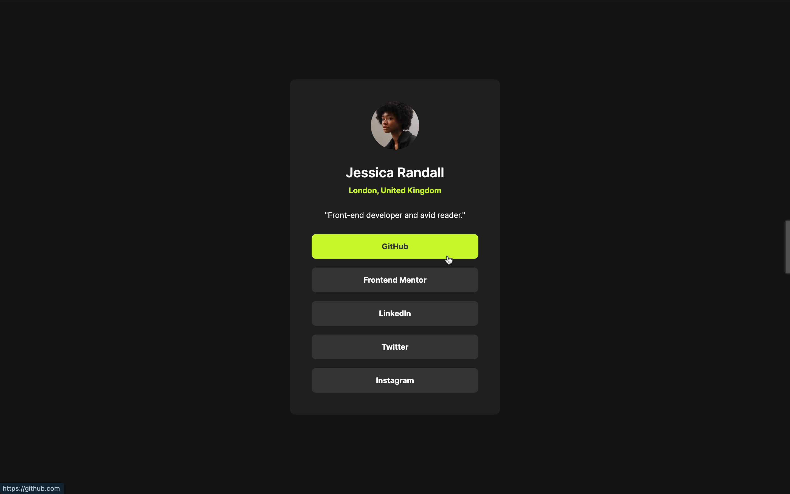

# Frontend Mentor - Social links profile solution

## Table of contents

- [Overview](#overview)
  - [The challenge](#the-challenge)
  - [Screenshot](#screenshot)
  - [Links](#links)
- [My process](#my-process)
  - [Built with](#built-with)
  - [What I learned](#what-i-learned)
  - [Continued development](#continued-development)
- [Author](#author)


## Overview

### The challenge

Users should be able to:

- See hover and focus states for all interactive elements on the page

### Screenshot
**Desktop View**<br>

**Active Hover View**<br>


### Links
- Solution URL: [https://github.com/anamaydev/FrontEndMentor/tree/main/QRCodeComponent](https://github.com/anamaydev/FrontEndMentor/tree/main/socialLinksProfile)
- Live Site URL: [https://anamaydev.github.io/FrontEndMentor/QRCodeComponent/index.html](https://anamaydev.github.io/FrontEndMentor/socialLinksProfile/index.html)

## My process

### Built with

- HTML5 markup
- CSS
- Flexbox

### What I learned
I learned how to create smooth hover effects using the CSS transition property. This allows for a gradual change in background color when hovering over elements, enhancing the user experience.

```css
.links>a{
    background-color: #333333;
    transition: background-color 0.8s;
}

.links>a:hover{
  color: #333333;
  background-color: #C4F82A;
  cursor: pointer;
}
```


### Continued development

I plan to learn more about the transition property and implement cool effects in future projects.

## Author
- Frontend Mentor - [@anamaydev](https://www.frontendmentor.io/profile/anamaydev)