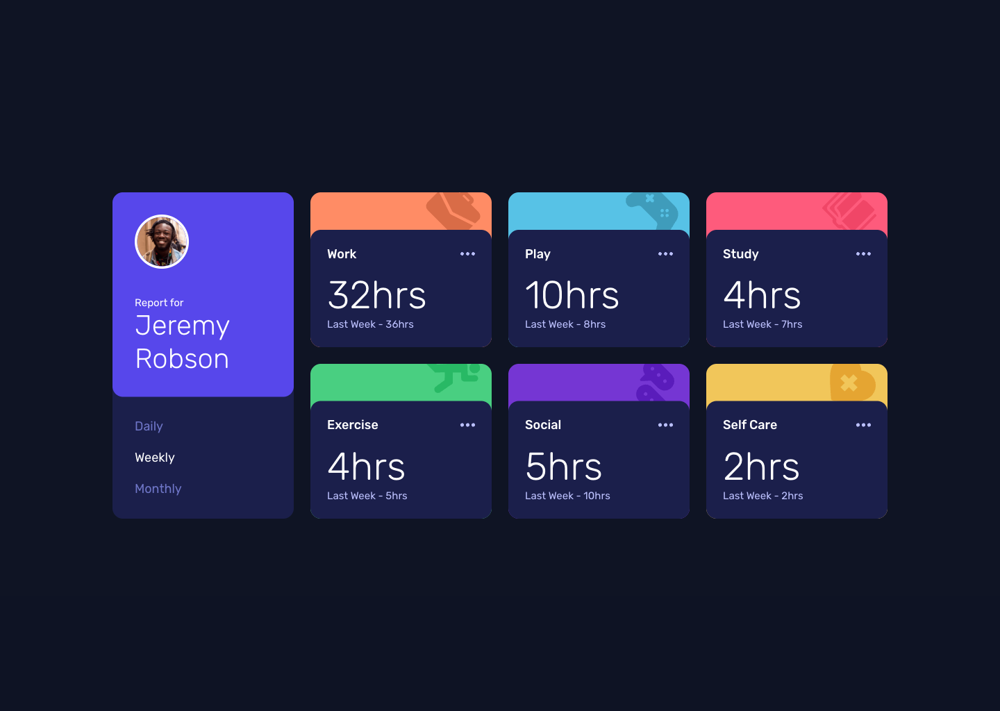

# Frontend Mentor - Time tracking dashboard solution
## Table of contents

- [Overview](#overview)
  - [The challenge](#the-challenge)
  - [Screenshot](#screenshot)
  - [Links](#links)
- [My process](#my-process)
  - [Built with](#built-with)
  - [What I learned](#what-i-learned)
  - [Continued development](#continued-development)
  - [Useful resources](#useful-resources)
- [Author](#author)
- [Acknowledgments](#acknowledgments)

## Overview

### The challenge

Users should be able to:

- View the optimal layout for the site depending on their device's screen size
- See hover states for all interactive elements on the page
- Switch between viewing Daily, Weekly, and Monthly stats

### Screenshot

### Links

- Solution URL: [https://github.com/anamaydev/FrontEndMentor/tree/main/time-tracking-dashboard](https://github.com/anamaydev/FrontEndMentor/tree/main/time-tracking-dashboard)

- Live Site URL: [https://anamaydev.github.io/FrontEndMentor/time-tracking-dashboard/index.html](https://anamaydev.github.io/FrontEndMentor/time-tracking-dashboard/index.html)

## My process

### Built with

- Semantic HTML5 markup
- CSS custom properties
- Flexbox
- CSS Grid
- Mobile-first workflow
- [GSAP](https://gsap.com/docs/v3/) - JavaScript Animation library

### What I learned
I was worried that declaring a global variable would let any script access it, causing security issues.
Then I learned about JavaScript closures, which help protect variables.

## Author

- Frontend Mentor - [@anamaydev](https://www.frontendmentor.io/profile/anamaydev)