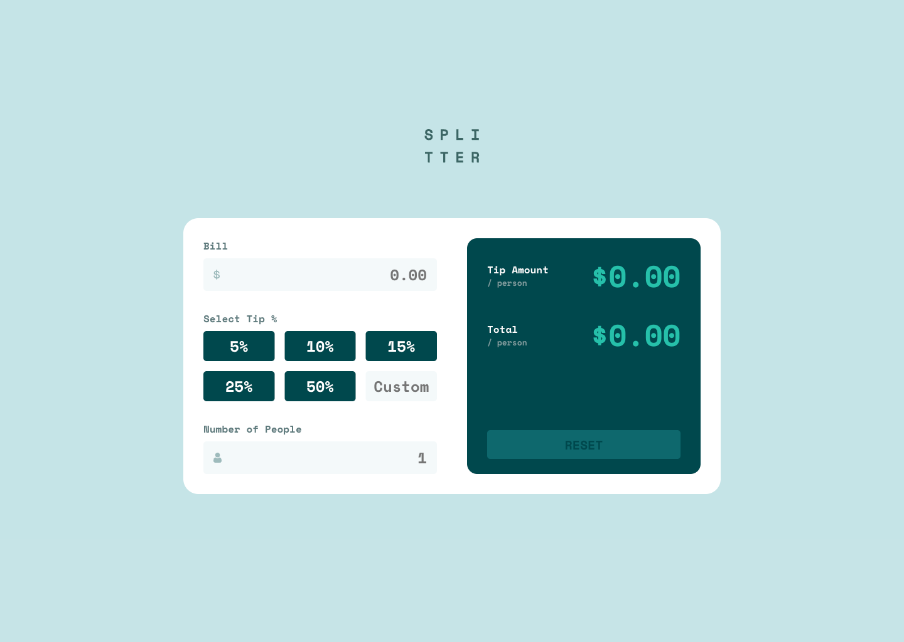

# Frontend Mentor - Tip calculator app solution

This is a solution to the [Tip calculator app challenge on Frontend Mentor](https://www.frontendmentor.io/challenges/tip-calculator-app-ugJNGbJUX). Frontend Mentor challenges help you improve your coding skills by building realistic projects.

## Table of contents

- [Overview](#overview)
  - [The challenge](#the-challenge)
  - [Screenshot](#screenshot)
  - [Links](#links)
- [My process](#my-process)
  - [Built with](#built-with)
  - [What I learned](#what-i-learned)
- [Author](#author)

## Overview

### The challenge

Users should be able to:

- View the optimal layout for the app depending on their device's screen size
- See hover states for all interactive elements on the page
- Calculate the correct tip and total cost of the bill per person

### Screenshot



### Links

- Solution URL: [https://github.com/anamaydev/FrontEndMentor/tree/main/tip-calculator-app](https://github.com/anamaydev/FrontEndMentor/tree/main/tip-calculator-app)

- Live Site URL: [https://anamaydev.github.io/FrontEndMentor/tip-calculator-app/index.html](https://anamaydev.github.io/FrontEndMentor/tip-calculator-app/index.html)

## My process

### Built with

- Semantic HTML5 markup
- CSS custom properties
- Flexbox
- CSS Grid
- Mobile-first workflow

### What I learned
I learn we can hide an element with `hidden` attribute

```html
<button id="button" type="button" hidden>Submit</button>>
```
  - The attribute `hidden` is nothing but a boolean and we can toggle it using JavaScript
```js
const button = document.getElementById('button');
button.hidden = false;
```

## Author

- Frontend Mentor - [@anamaydev](https://www.frontendmentor.io/profile/anamaydev)
